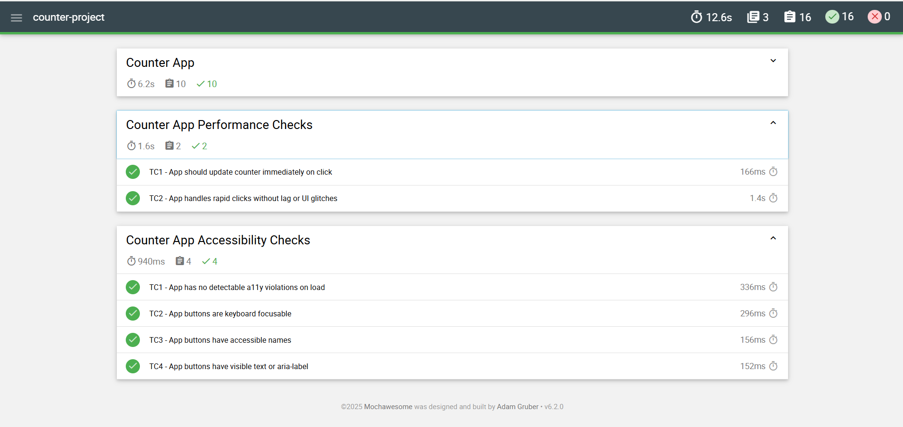
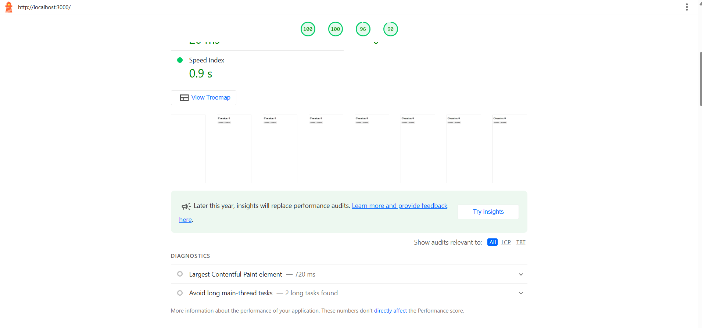

# Counter App QA Project

This project is a QA-focused test framework for a simple counter app for the QA task. It's built using Cypress for E2E testing and includes accessibility and performance auditing using Lighthouse,
Reports are auto-generated and uploaded as GitHub Action artifacts.
The original application had logic and accessibility issues. As part of the challenge, they were logged and minimal changes were applied only when necessary to support automation.

## This framework includes:

- Functional E2E tests using `Cypress`
- Accessibility checks using `axe-core`
- Performance audits using `Lighthouse`
- Report generation using `Mochawesome`
- GitHub Actions CI configuration for automated testing and reporting

## Prerequisites:
- Node.js (v18+ recommended, it works with v22): https://nodejs.org/en
- npm (comes with Node.js)

## Dependencies installation:
- `npm install`

### 1. Clone the repository:
- Run the following command in the local project terminal:
`git clone https://github.com/ahmedsaad2050/counter-project.git`

### 2. Run npm install
- `npm install`

### 3. Start the server locally:
- `npm start`

### 4. Run Cypress tests:
- `npm run cy:run`

### 5. Start the server and run Cypress tests in one command:
- `npm run test`  ==> This will start the server and run Cypress tests automatically.

### 6. Run Lighthouse performance audit:
- `npm run lighthouse`

### 7. Run ESLint on the code:
- `npm run eslint`

### 8. Combine Mochawesome Reports:
- `npx mochawesome-merge "cypress/reports/*.json" --output cypress/reports/final-report.json`
- `npx marge cypress/reports/final-report.json -f final-report -o cypress/reports --inline`
### 9. View the generated report or the lighthouse-report:
- `cypress/reports/final-report.html`
- `cypress/reports/lh-report.html`

##  CI & Reporting:
- GitHub Actions workflow runs on pull requests to develop and master
- Cypress and Lighthouse reports are uploaded as downloadable artifacts
- Mochawesome merges all Cypress test results into a single HTML report
- Here's a screenshot of the lightouse-report and the final report (E2E, Accessibility & Performance checks):

## Project Structure
- `cypress/e2e/` – Functional tests
- `cypress/accessibility/` – Accessibility tests using axe-core.
- `cypress/performance/` – Lighthouse performance test.
- `cypress/pages/` – Page Object Model abstraction.
- `cypress/reports/` – Output directory for HTML reports.
- `.github/workflows/` - GitHub Actions config.

## Notes:
- Accessibility violations are logged, to reflect the original app state.
- Performance audits run in headless mode via Lighthouse with Chrome stable.
- Cypress test failures can be reviewed in the generated reports or CI output.
- The used versions of tools and libraries are latest or the latest stable to ensure compatibility.

## Assumptions: 
- The QA role includes a white-box testing approach, including analyzing and fixing functional, accessibility and performance issues if they block valid test automation or reporting.
- All accessibility and performance issues are logged for awareness